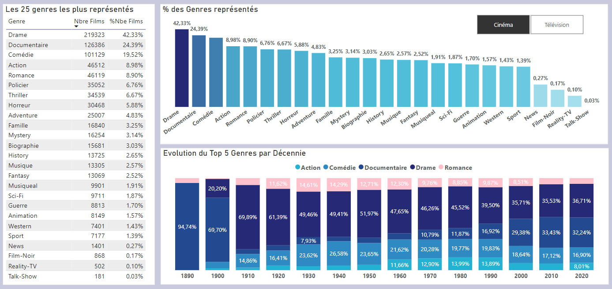
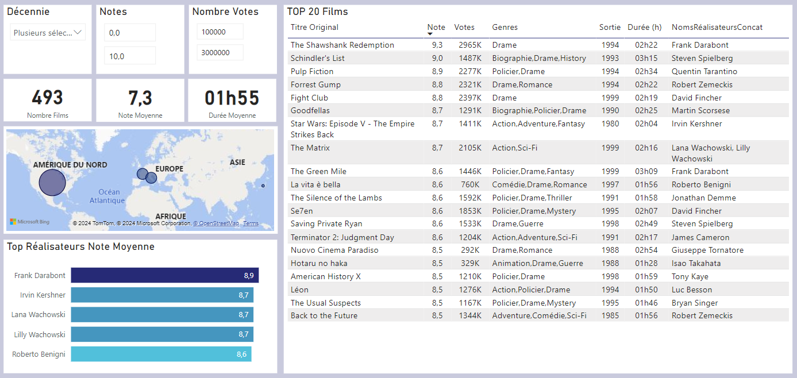
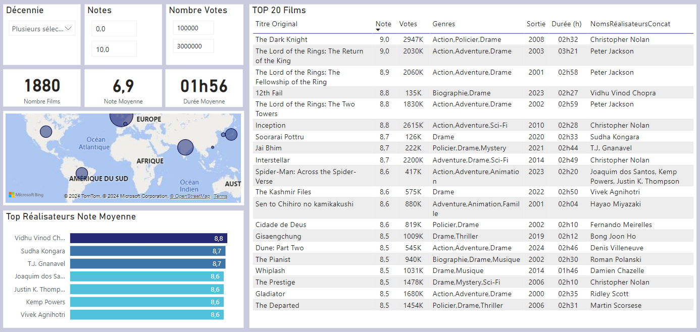
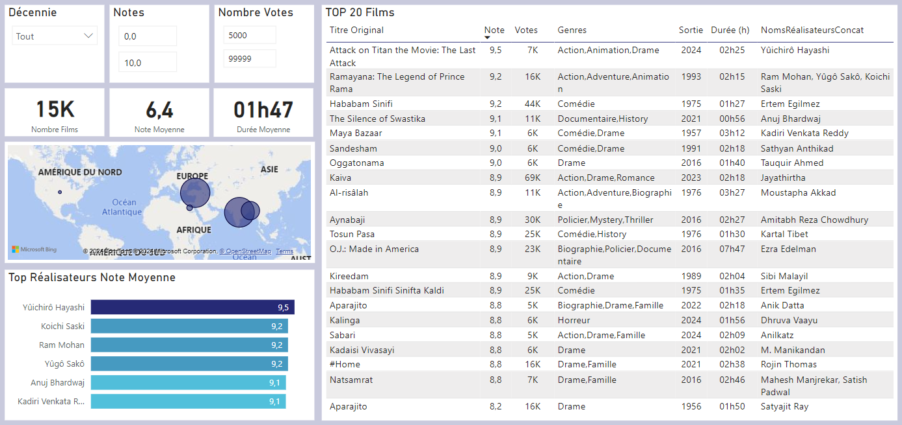
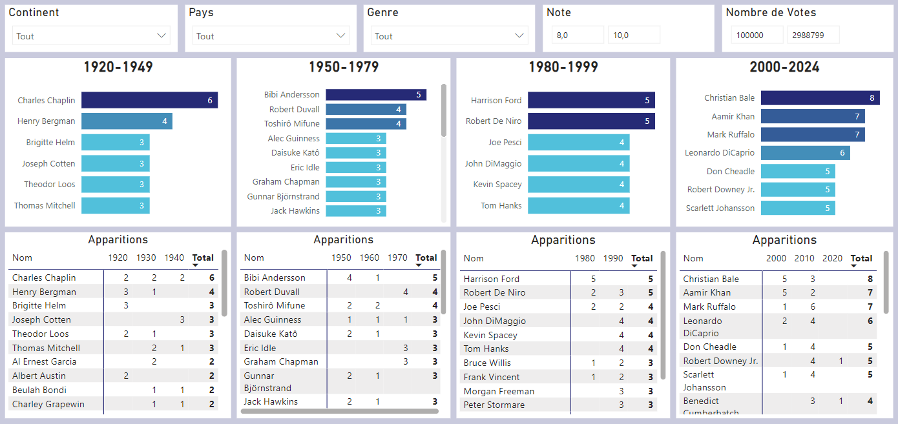
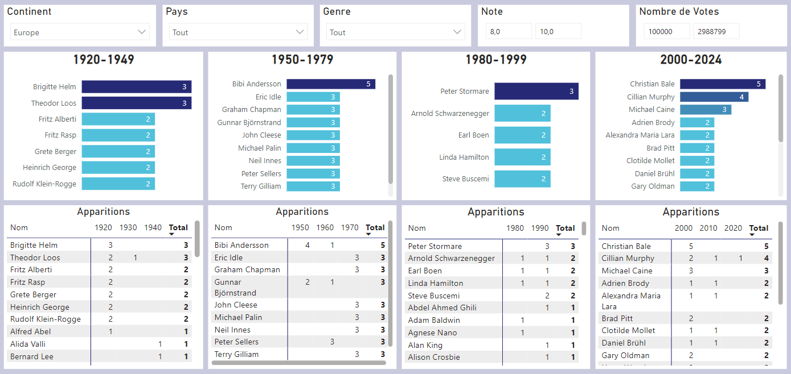
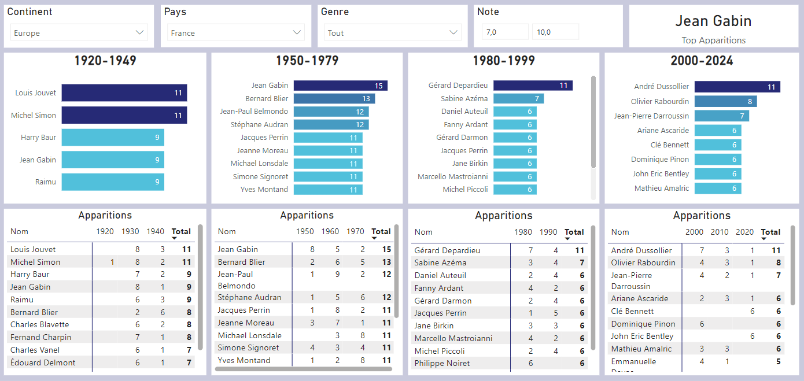

# Analyse des KPI et Visualisation

## 🎯 Objectifs de l'analyse
L'objectif de ce projet est d'explorer les bases de données IMDb et TMDb afin d'en tirer des insights pertinents à l'aide de visualisations PowerBI.

Couplés à l'Etude de Marché précédemment réalisée, ces insights nous permettront de définir l'orientation stratégique pour la suite du projet et nos choix quant aux sélections d'oeuvres pour le moteur de recommandation.

Les principales analyses du dashboard présenteront :

1. **La vue générale des bases de données (Oeuvres, Supports, Genres, Pays)**
2. **Les films les mieux notés et les caractéristiques qu'ils partagent.**
3. **L'évolution de la durée moyenne des films au fil des années.**
4. **L'identification des acteurs les plus présents et les périodes associées.**
5. **La comparaison entre les acteurs présents au cinéma et dans les séries.**
6. **L'âge moyen des acteurs.** 

---

## 📋 Méthodologie
### Étapes clés :

1. **Préparation des données Power BI:**
   - Nettoyage des datasets IMDb et TMDb pour éliminer les doublons et les valeurs manquantes.
   - Standardisation des formats de colonnes (dates, durées, notes, etc.).
   - Fusion des datasets pour enrichir les analyses (liens entre acteurs, films et séries).
   - Mise en place des relations entre les tables (Schéma en Etoile).
   - Création des mesures utiles pour les KPI.

2. **Construction des visualisations Power BI :**
   - Création de rapports dynamiques et interactifs.
   - Mise en place de filtres et slicers pour explorer les données en détail.
 

- 📊 **[Accès au dashboard PowerBI (format PDF)](../pdf/rapport_powerbi_kpi.pdf)**

---

##  **Schéma de liaison des Tables sur Power BI**

 

---

## Périmètre d'analyse

- ***Cinéma*** : Tous les films - hors Court Métrages
- ***Télévision*** : Uniquement TVSeries
- **Suppression des Films et Séries pour Adulte**

---

##  **📊 KPI** : Vue générale des bases de données
 

### Nombre d'oeuvres par supports, Durée Moyenne et Evolution par Décennie
 

***Source : ImdB title.basics***
 

#### Analyse

- **Nombre total d'œuvres (hors films adultes)** : ***834 859***, dont ***587 074*** pour le Cinéma et ***247 785*** pour la Télévision.  
- **Répartition des supports** : ***70,3 % Cinéma*** et ***29,7 % Télévision***.  
- **Évolution temporelle des œuvres** :  
  - **1890 à 1949** : Augmentation progressive des œuvres cinématographiques avec un pic dans les années 1920-1930 (~22K à 21K films). La télévision est quasi absente.  
  - **1950 à aujourd'hui** : Explosion significative du nombre d’œuvres, notamment dans les années 2010 avec un maximum de ***167K films***. La Télévision montre une croissance régulière, atteignant un pic en ***2020 (50K séries)***.  
- **Durée moyenne des films et séries** :  
  - Films (Cinéma) : ***1h30 (90 minutes)*** en moyenne, stable depuis les années 1950.  
  - Séries (Télévision) : ***46 minutes*** en moyenne, mais avec des variations importantes au fil des décennies.  

### **Insights pertinents pour la suite :**
- La forte proportion de films dans la base (70,3 %) favorise le développement d’un moteur axé prioritairement sur le Cinéma.  
- La période récente (2000 à aujourd'hui) est la plus productive en termes de contenu, ce qui suggère une orientation sur les œuvres contemporaines pour répondre aux attentes des utilisateurs.  
- La stabilité de la durée moyenne des films (90 minutes) et des séries (46 minutes) est un indicateur clé pour ajuster les recommandations en fonction de la disponibilité des utilisateurs (ex. : recommandations de "binge-watch" ou d'œuvres courtes).
 

---

### Analyse des Genres au Cinéma
 

***Source : ImdB title.basics***
 

#### **Analyse**

1. **Répartition des Genres :**
   - Les genres principaux sont le Drame, la Comédie et le Thriller, qui dominent largement la production cinématographique.  
   - Les films d’Action, Science-Fiction et Fantastique représentent une part significative, particulièrement depuis les années 2000, en lien avec l'essor des blockbusters et des avancées technologiques.  
   - Les films de Romance et les Comédies Romantiques gardent une place importante, souvent associés à un public spécifique et des périodes clés comme la Saint-Valentin.  
   - Les films d’Horreur, bien que moins dominants, conservent une base de fans fidèles, notamment lors de festivals ou d'événements comme Halloween.

2. **Évolution des Genres :**
   - Une montée en puissance des genres liés à la Science-Fiction et aux Super-héros, avec des univers partagés comme ceux de Marvel et DC.  
   - Une résurgence des documentaires et des films indépendants dans les années 2010, en partie grâce à l'influence des plateformes de streaming.  
   - Les genres comme le Western ou les films de Guerre, autrefois très populaires, tendent à diminuer mais subsistent par des œuvres marquantes ou des réinterprétations modernes.

3. **Genres de Niche :**
   - Les genres comme le Musical, bien que minoritaires, attirent un public fidèle, notamment grâce à des succès récents comme *La La Land* ou des adaptations de comédies musicales.  
   - Les films Biographiques et Historiques gagnent en popularité, souvent récompensés dans des cérémonies comme les Oscars.

#### **Insights pertinents**

1. **Pour le moteur de recherche :**
   - **Filtrage par Genre Principal :**  
     - Proposer un classement clair des œuvres par genre, avec la possibilité d’affiner selon des sous-genres (par exemple, Comédie > Comédie romantique).  
     - Intégrer des recommandations croisées entre genres similaires ou complémentaires (ex. : Thriller + Horreur ou Drame + Biographique).  
   - **Popularité par Genre :**  
     - Mettre en avant les genres populaires auprès des utilisateurs, basés sur les données d’interaction ou de visionnage récents.  
   - **Recommandations Contextuelles :**  
     - En fonction de la période de l’année, promouvoir des genres spécifiques (par exemple, des films de Noël en décembre ou des films d’horreur en octobre).  
     - Permettre la recherche par ambiance (ex. : "feel-good", "intense", "nostalgique").

2. **Pour la programmation cinéma :**
   - **Soirées Thématiques :**  
     - Organiser des soirées ou week-ends thématiques autour des genres dominants (Drame, Comédie, Thriller) en sélectionnant des films représentatifs de chaque décennie.  
     - Proposer des événements spéciaux autour de genres de niche, comme les Musicals ou les Documentaires.  
   - **Cycles Par Genre :**  
     - Créer des cycles récurrents, comme une semaine dédiée à la Science-Fiction ou un mois de l’Horreur, avec des œuvres cultes et modernes.  
   - **Mise en avant de genres émergents ou sous-représentés :**  
     - Proposer une programmation qui met en lumière des genres moins dominants comme le Western, le Musical, ou des films Historiques.  
   - **Focus sur les Sous-Genres :**  
     - Explorer des sous-genres spécifiques avec des marathons (ex. : films de Super-héros des années 2000 ou Comédies romantiques des années 90).  
   - **Collaboration avec des événements ou festivals :**  
     - Collaborer avec des festivals ou événements pour renforcer la visibilité de certains genres, comme un festival de documentaires ou une soirée dédiée aux films primés.  

En structurant une approche de filtrage par genre et en diversifiant la programmation, le cinéma peut répondre à des goûts variés tout en créant des opportunités pour attirer des spectateurs curieux ou passionnés par des types de films spécifiques. Une stratégie équilibrée entre œuvres populaires et de niche peut ainsi renforcer l'attractivité globale.
 

---

### Analyse des Genres dans les Séries TV
 

***Source : ImdB title.basics***
 

#### **Analyse**

1. **Répartition des Genres :**  
   - **Drame et Comédie** dominent largement le paysage des séries télévisées, ce qui témoigne de leur capacité à captiver des publics divers sur plusieurs saisons.  
   - **Thriller et Crime** occupent une place significative, souvent associés à des récits captivants et des intrigues à suspense.  
   - **Science-Fiction et Fantastique** connaissent une croissance soutenue, soutenue par des séries cultes comme *Stranger Things* ou *Game of Thrones*.  
   - Les genres comme le **Documentaire** et la **Romance**, bien que plus ciblés, ont un public fidèle et une forte présence dans les catalogues des plateformes de streaming.  

2. **Évolution des Tendances :**  
   - Les dernières décennies montrent une montée en puissance des récits complexes et des genres hybrides, mélangeant Drame et Science-Fiction ou Comédie et Romance.  
   - Les séries **d’animation** destinées aux adultes, telles que *Rick and Morty* ou *BoJack Horseman*, deviennent un genre à part entière, avec un public croissant.  
   - Les séries **documentaires** et **true crime**, popularisées par des plateformes comme Netflix, génèrent un engouement particulier grâce à des histoires intrigantes basées sur des faits réels.  

3. **Genres de Niche :**  
   - Les genres comme **Musical**, bien qu’en marge, attirent un public loyal, notamment avec des productions marquantes comme *Glee*.  
   - Les séries **Historiques/Biographiques**, souvent récompensées dans des festivals, rencontrent un succès auprès des amateurs d’histoire et de culture.  

#### **Insights pertinents**

1. **Pour le moteur de recherche :**  
   - **Filtrage par Genre :**  
     - Offrir une segmentation claire des genres avec la possibilité de rechercher des sous-genres ou des combinaisons (par exemple, "Drame + Crime" ou "Comédie + Science-Fiction").  
   - **Recommandations personnalisées :**  
     - Proposer des recommandations croisées basées sur les tendances observées (ex. : les amateurs de Drame pourraient aimer les séries hybrides avec du Fantastique).  
   - **Filtres avancés :**  
     - Ajouter des options pour explorer des genres selon la durée des épisodes, le type de format (mini-série ou série longue), ou la note critique.  

2. **Pour la programmation cinéma :**  
   - **Événements spéciaux :**  
     - Organiser des marathons ou des projections exceptionnelles pour des séries emblématiques dans des genres populaires (ex. : *Breaking Bad* pour le Crime ou *The Office* pour la Comédie).  
   - **Focus sur les adaptations :**  
     - Mettre en avant les adaptations de séries TV au cinéma ou vice versa, pour renforcer le lien entre les deux formats.  
   - **Séries documentaires ou historiques :**  
     - Proposer des projections de documentaires ou de séries basées sur des faits réels pour un public en quête de contenu éducatif.  
   - **Mise en avant des séries hybrides :**  
     - Explorer les genres émergents ou des combinaisons innovantes qui attirent un public curieux et diversifié.  
   - **Expériences immersives :**  
     - Créer des expériences interactives autour de séries cultes (ex. : reconstitutions d’univers fictifs ou événements costumés).  

L’analyse des genres dans les séries TV révèle une diversité de contenus adaptée à des audiences variées. En proposant un moteur de recherche précis et une programmation basée sur des genres phares ou de niche, le cinéma peut élargir son attractivité tout en répondant aux goûts d’un public en quête de récits engageants et captivants.
 

---

### Répartition des Films par Pays
 

***Source : TmdB***
 

#### **Analyse**

1. **Domination des États-Unis :**  
   - Les productions américaines représentent une part écrasante des œuvres dans le cinéma et les séries TV, grâce à la puissance de Hollywood et à l’attrait international de leurs contenus.  
   - Une grande diversité de genres et de formats explique cette position dominante, accompagnée d’une forte capacité de distribution globale.  

2. **Contributions notables d'autres pays :**  
   - **Royaume-Uni :** Reconnu pour ses drames historiques et séries à la production soignée, ce pays est une source majeure de contenus de qualité.  
   - **France :** Positionnée comme un acteur majeur du cinéma mondial, avec des œuvres célébrées pour leur sophistication et leur diversité thématique.  
   - **Inde :** Bollywood et son industrie cinématographique unique apportent une identité forte, marquée par des récits épiques, des danses, et des musiques mémorables.  
   - **Canada :** En partie grâce à des coproductions nord-américaines, il offre un mélange de contenus locaux et internationaux.  
   - **Japon :** La force de l’animation et des films culturels confère au Japon une place importante, attirant un public mondial grâce à des œuvres comme *Spirited Away*.  

3. **Diversité régionale :**  
   - L’Europe, notamment par la France, l’Allemagne et l’Italie, contribue à un riche patrimoine cinématographique et des séries qualitatives, bien que plus localisées.  
   - L’Asie de l’Est, avec le Japon et la Corée du Sud, monte en puissance, notamment grâce à l’explosion des K-dramas et du cinéma d’animation.  

4. **Œuvres globales :**  
   - Certaines œuvres ou coproductions impliquent plusieurs pays, offrant une perspective internationale qui enrichit le contenu et attire un public diversifié.  

#### **Insights pertinents**

1. **Pour le moteur de recherche :**  
   - **Filtres par région et pays :**  
     - Ajouter la possibilité de chercher des œuvres par origine géographique, permettant de cibler des œuvres britanniques, françaises, indiennes, ou japonaises, selon les préférences de l’utilisateur.  
   - **Focus sur la diversité culturelle :**  
     - Proposer des recommandations basées sur des œuvres moins connues mais issues de régions émergentes.  
   - **Recherche multicritères :**  
     - Intégrer des critères croisés, comme pays d’origine et genre, pour une expérience utilisateur enrichie.  

2. **Pour la programmation cinéma :**  
   - **Soirées thématiques :**  
     - Organiser des événements autour de la production d’un pays ou d’une région spécifique (ex. : Bollywood Night, Festival des films britanniques).  
   - **Promotion des pépites internationales :**  
     - Mettre en avant des œuvres de pays moins représentés, renforçant l’attrait pour un public curieux de diversité culturelle.  
   - **Valorisation de l’Europe :**  
     - Créer une programmation dédiée au cinéma européen ou à des coproductions internationales, en misant sur la richesse artistique.  
   - **Focus sur l’Asie :**  
     - Capitaliser sur l’intérêt croissant pour les œuvres japonaises, coréennes, ou chinoises, notamment dans les genres animation, drame et fantastique.  
   - **Films historiques ou documentaires :**  
     - Proposer des films en lien avec l’histoire ou la culture des pays représentés pour des séances éducatives ou immersives.  
 
L’analyse géographique des œuvres met en lumière une forte hégémonie américaine mais aussi une diversité culturelle précieuse. En s’appuyant sur ces données, le cinéma peut enrichir son offre en alternant entre productions populaires et découvertes internationales, tout en offrant un moteur de recherche adapté aux cinéphiles en quête de nouvelles expériences culturelles.
 

---

### Films les mieux notés et leurs caractéristiques
 

### Top Films 1920 - 1949

***Source : ImdB - TmdB***
 

#### Analyse

- **Top 10 des films selon la note moyenne** :
Les films les mieux notés de cette période incluent des classiques intemporels qui ont marqué l'histoire du cinéma.
Ils sont souvent issus de réalisateurs de renom et bénéficient d'une reconnaissance critique exceptionnelle.
Les genres semblent variés (drame, film noir, comédie romantique).
La majorité des films provient des États-Unis, soulignant l'impact d'Hollywood dès ses débuts.

- **Top 10 selon le nombre de votes** :
Ces films ont une notoriété massive auprès des spectateurs, même aujourd'hui.
La popularité peut être attribuée à des rééditions, des restaurations, ou à une présence régulière dans des rétrospectives ou plateformes de streaming.
Les genres incluent des drames et des films emblématiques souvent étudiés dans les écoles de cinéma.
Là encore, une forte représentation des films américains est notable.

#### Insights pertinents

- **Pour le moteur de recherche** :

Intégrer un filtre spécifique pour les films classiques (années 1920-1949), afin de valoriser cette période.
Inclure des classements selon les deux métriques principales (note et votes), permettant aux spectateurs de choisir entre qualité critique et popularité.
Proposer une catégorie dédiée pour les réalisateurs emblématiques de cette période (Hitchcock, Chaplin, etc.).

- **Pour la programmation cinéma** :

Focus sur les films les mieux notés : Ces œuvres attireraient un public de cinéphiles cherchant à découvrir ou redécouvrir des classiques peu accessibles en salle.
Mise en avant des films les plus votés : Ils garantissent une forte attractivité, notamment grâce à leur popularité persistante et leur impact culturel.
Organiser des cycles thématiques : Proposer des rétrospectives par réalisateur ou par genre dominant (ex. : film noir, comédie romantique, drame).
Prévoir des projections restaurées ou accompagnées de présentations pour enrichir l’expérience et l’intérêt historique.
 

---

### Top Films 1950-1979

***Source : ImdB - TmdB***
 

#### Analyse

1. **Top 10 des films selon la note moyenne :**  
   - Les films de cette période incluent des chefs-d’œuvre incontournables qui ont façonné le cinéma moderne.  
   - Les genres dominants sont variés : drame, science-fiction, thriller et comédie.  
   - Les réalisateurs comme Stanley Kubrick, Akira Kurosawa ou Sergio Leone sont fortement représentés, soulignant leur importance artistique.  
   - Hollywood reste dominant, mais l'influence internationale se fait plus marquée (notamment le Japon et l'Europe).  

2. **Top 10 selon le nombre de votes :**  
   - Ces films, largement populaires, ont un impact culturel énorme qui perdure encore aujourd’hui.  
   - On observe une surreprésentation des blockbusters et des œuvres cultes (notamment des films de science-fiction ou de fantasy).  
   - Les sagas et franchises emblématiques commencent à émerger dans cette période (ex. : *Star Wars*).  

#### **Insights pertinents**  

1. **Pour le moteur de recherche :**  
   - Ajouter une section pour les œuvres de 1950 à 1979, avec la possibilité de filtrer par *note* ou *nombre de votes*.  
   - Proposer des recommandations par réalisateurs emblématiques de cette période (Kubrick, Kurosawa, Leone, Fellini).  
   - Inclure un filtre pour les œuvres ayant marqué des genres spécifiques (sci-fi, western spaghetti, drame psychologique).  

2. **Pour la programmation cinéma :**  
   - **Focus sur les films les mieux notés :** Organiser des soirées « chefs-d’œuvre », ciblant les cinéphiles à la recherche de films reconnus pour leur qualité artistique.  
   - **Films les plus votés :** Mettre en avant des blockbusters cultes pour attirer un public plus large, nostalgique des classiques populaires.  
   - **Cycles par genres et réalisateurs :** Par exemple :  
     - Cycle *Stanley Kubrick* avec des projections comme *2001, l’Odyssée de l’Espace* ou *Orange Mécanique*.  
     - Cycle *westerns spaghetti* avec les œuvres de Sergio Leone (*Le Bon, la Brute et le Truand*).  
   - **Événements interactifs :** Ajouter des débats ou des analyses post-projection pour renforcer l’expérience culturelle.  

Cette période, riche en innovations et en classiques incontournables, est idéale pour séduire à la fois un public cinéphile et des amateurs de blockbusters. Le moteur de recherche et la programmation cinéma peuvent ainsi valoriser la diversité et l’impact des films de cette époque.
 

---

### Top Films 1980-1999

***Source : ImdB - TmdB***
 

#### Analyse

1. **Top 10 des films selon la note moyenne :**  
   - Cette période est marquée par des œuvres devenues des références culturelles, notamment dans les genres du drame, du thriller psychologique et de la science-fiction.  
   - Les films de cette liste, comme *The Shawshank Redemption* (*Les Évadés*), *Pulp Fiction* ou *Schindler's List*, témoignent d'une période où le storytelling puissant et la profondeur émotionnelle sont au premier plan.  
   - Les réalisateurs de renom comme Steven Spielberg, Quentin Tarantino et David Fincher dominent avec des chefs-d'œuvre intemporels.  
   - Les films internationaux gagnent également en reconnaissance, notamment à travers des productions plus accessibles pour un public mondial.

2. **Top 10 selon le nombre de votes :**  
   - Les films les plus votés de cette période incluent des blockbusters emblématiques tels que *The Matrix*, *The Lord of the Rings* (précurseur avec *The Fellowship of the Ring*) et des films de science-fiction comme *Terminator 2*.  
   - Le cinéma d'action et les franchises dominent le classement, reflétant une explosion des films orientés grand public et le début de l'ère des superproductions à gros budget.  
   - Ces films continuent de bénéficier de vastes communautés de fans, notamment grâce à Internet et aux plateformes comme IMDb. 

#### **Insights pertinents**

1. **Pour le moteur de recherche :**  
   - Ajouter une option spécifique pour explorer les films des années 1980-1999, avec des filtres par *note moyenne* et *popularité* (nombre de votes).  
   - Inclure des catégories par réalisateurs marquants (Tarantino, Spielberg, James Cameron, les Wachowski) pour permettre un ciblage des recherches par affinité cinématographique.  
   - Mettre en avant les sagas et franchises majeures de cette période, notamment pour attirer les fans nostalgiques de ces œuvres.  

2. **Pour la programmation cinéma :**  
   - **Soirées Blockbusters des années 80-90 :** Créer un événement dédié aux superproductions cultes (*Terminator 2*, *Jurassic Park*, *The Matrix*), pour raviver l'intérêt des fans de science-fiction et d'action.  
   - **Hommage aux drames intemporels :** Diffuser des œuvres comme *Les Évadés* ou *Schindler's List* dans un cadre cinéphile avec des analyses ou des débats après projection.  
   - **Cycles thématiques par réalisateur :**  
     - Un cycle Spielberg pour découvrir sa contribution au cinéma (action, drame, aventure).  
     - Un cycle Tarantino avec des films comme *Pulp Fiction* et *Reservoir Dogs*.  
   - **Événements intergénérationnels :** Mettre en avant des films familiaux iconiques de cette période (*E.T.*, *The Lion King*) pour réunir un public de tout âge.  

Cette période, riche en superproductions et en récits emblématiques, est parfaite pour satisfaire une audience diversifiée : des fans de blockbusters, des cinéphiles à la recherche de récits profonds, et des nostalgiques des classiques des années 80-90. Le moteur de recherche et la programmation peuvent ainsi s'adapter aux attentes variées de ce public.
 

---

### Top Films 2000-2024

***Source : ImdB - TmdB***
 

#### Analyse

1. **Top 10 des films selon la note moyenne :**  
   - Cette période est dominée par des films alliant puissance narrative et excellence technique, comme *The Dark Knight*, *The Lord of the Rings: The Return of the King*, et *Inception*.  
   - Les genres variés, incluant la fantasy, la science-fiction, et les thrillers psychologiques, séduisent à la fois les critiques et le grand public.  
   - Le cinéma international s’impose également : *Parasite*, une production sud-coréenne, a marqué l’histoire en remportant de multiples distinctions, dont l’Oscar du meilleur film en 2020.  
   - Des réalisateurs visionnaires comme Christopher Nolan, Peter Jackson, et Bong Joon-ho sont omniprésents dans ce classement.

2. **Top 10 selon le nombre de votes :**  
   - Les films les plus votés comprennent des œuvres emblématiques comme *Avengers: Endgame*, *Avatar*, et *The Dark Knight*, illustrant l’hégémonie des franchises Marvel et DC dans le paysage cinématographique.  
   - Cette période reflète l’essor des blockbusters grand public et l’industrialisation des univers cinématographiques partagés (notamment le MCU).  
   - Les films basés sur des sagas populaires (*Harry Potter*, *The Lord of the Rings*, *Star Wars*) continuent de captiver les foules.  
   - La popularité des plateformes de notation en ligne amplifie l’impact des fandoms sur les tendances.  

#### **Insights pertinents**

1. **Pour le moteur de recherche :**  
   - Ajouter un filtre par période spécifique (2000-2024) et par franchise majeure (Marvel, DC, *Harry Potter*, etc.).  
   - Permettre de trier les films par note moyenne et nombre de votes, pour répondre à la fois aux attentes des cinéphiles et des amateurs de blockbusters.  
   - Intégrer des catégories comme :  
     - Films oscarisés (*Parasite*, *The Return of the King*).  
     - Films de réalisateurs renommés (Nolan, Villeneuve, Bong Joon-ho).  
     - Films de science-fiction et fantasy incontournables.  

2. **Pour la programmation cinéma :**  
   - **Marathons Franchises :** Proposer des marathons autour des sagas cultes comme *The Lord of the Rings*, *Harry Potter*, ou l’univers Marvel, pour fidéliser un public jeune et intergénérationnel.  
   - **Cycles Réalisateurs Visionnaires :** Dédiés à des figures majeures comme Christopher Nolan, Denis Villeneuve, ou Peter Jackson, avec des projections accompagnées de discussions thématiques.  
   - **Projections Événements :**  
     - Diffusion de films oscarisés suivie de débats ou de conférences (*Parasite*, *Slumdog Millionaire*).  
     - Hommage aux blockbusters marquants (*Avatar*, *Avengers: Endgame*), couplé à des expériences immersives (3D, IMAX).  
   - **Focus sur le cinéma international :** Proposer des séances axées sur les productions non-anglophones récompensées (*Parasite*, *Amélie*).  

Cette période illustre un équilibre entre la force des blockbusters et des sagas cinématographiques et l’émergence d’œuvres originales et audacieuses. Une stratégie mixte permettrait d’attirer une audience variée, de la génération Marvel aux amateurs de films primés et à fort impact artistique.
 

---

### Top Films (Votes < 100000)

***Source : ImdB - TmdB***
 

#### Analyse

1. **Films Classiques avec Notes Élevées :**  
   - Ces films sont souvent des œuvres méconnues du grand public mais très appréciées par une niche cinéphile.  
   - Les genres représentés varient entre drames, films historiques, documentaires, et films d’auteur.  
   - Le soin apporté à la narration, à la photographie, et aux thématiques universelles est un point commun.  
   - Certaines œuvres proviennent de cinémas moins médiatisés (cinéma scandinave, Asie centrale, cinéma indépendant américain).

2. **Profil des Films :**  
   - La période s'étend sur plusieurs décennies, allant de chefs-d’œuvre classiques à des productions modernes peu exposées médiatiquement.  
   - Les notes élevées témoignent d’une qualité cinématographique exceptionnelle, mais l’audience limitée pourrait s’expliquer par une distribution restreinte ou un marketing faible.  

3. **Niches Culturelles :**  
   - Films reflétant des cultures ou des périodes historiques spécifiques.  
   - Certains films indépendants abordent des thématiques atypiques ou controversées, attirant un public averti.  

#### **Insights pertinents**

1. **Pour le moteur de recherche :**  
   - Mettre en avant une catégorie "Pépites méconnues" avec des films ayant :  
     - Une note > 8/10.  
     - Moins de 100 000 votes.  
   - Ajouter des filtres basés sur :  
     - Le genre cinématographique (drame, documentaire, film historique).  
     - L'origine géographique pour révéler les richesses du cinéma international.  
   - Proposer une recommandation personnalisée pour les cinéphiles curieux.  

2. **Pour la programmation cinéma :**  
   - **Cycle "Trésors Cachés" :** Une série de projections dédiées aux films moins connus mais extrêmement bien notés.  
     - Inclure des introductions ou des discussions avec des critiques ou des cinéastes.  
   - **Ciné-club de niche :**  
     - Inviter des spectateurs à découvrir ces œuvres dans un cadre intimiste.  
     - Organiser des séances thématiques (cinéma d’auteur, exploration de régions cinématographiques peu connues).  
   - **Exploration culturelle :**  
     - Diffuser des films peu votés issus de cinémas spécifiques (scandinave, africain, asiatique).  
     - Mettre en avant le contexte historique ou culturel lors de ces séances.  
   - **Festival des découvertes :** Un mini-festival annuel consacré à ces pépites avec votes des spectateurs pour leur film préféré.  

En valorisant ces films au sein d’un moteur de recherche ou d’une programmation, un cinéma peut offrir une expérience enrichissante et différenciante, attirant une audience curieuse et passionnée par des œuvres de qualité souvent laissées de côté. Cela renforcerait l’image d’un cinéma axé sur la découverte et l’excellence.
 

---

### Top Films France (Production Française)

***Source : ImdB - TmdB***
 

**Attention !** : Certains films ci dessus sont en partie production française, en partie d'autres pays.

#### **Analyse**

1. **Sélection des films 100% français :**  
   - Les œuvres retenues excluent les coproductions avec d’autres pays afin de représenter uniquement la production nationale pure.  
   - Cette méthode met en avant les films qui reflètent le mieux l’identité et la culture cinématographique française.

2. **Tendances dans le top français :**  
   - **Genres dominants :**  
     - Une forte présence des drames, souvent appréciés pour leur profondeur narrative et leur introspection sur des thèmes universels.  
     - Les comédies sont également bien représentées, confirmant leur rôle central dans le paysage cinématographique français.  
   - **Réalisateurs iconiques :**  
     - Des noms incontournables du cinéma français apparaissent fréquemment, témoignant de leur impact culturel.  
     - On note également l’émergence de réalisateurs plus récents qui diversifient les styles et approches narratives.  
   - **Années marquantes :**  
     - Les films du début des années 2000 et les productions plus récentes dominent, reflétant une évolution vers des œuvres modernes et connectées aux enjeux contemporains.  

3. **Popularité et appréciation :**  
   - **Notes élevées :**  
     - Les œuvres françaises dans ce classement bénéficient souvent d’une reconnaissance critique et populaire.  
   - **Nombre de votes modéré :**  
     - Malgré des notes élevées, le volume de votes reste inférieur à celui des productions américaines, ce qui souligne une audience plus ciblée mais engagée.  

4. **Absence de productions massives :**  
   - Contrairement à Hollywood, la France privilégie des productions à taille humaine, centrées sur des récits authentiques et émotionnels, ce qui les distingue sur la scène internationale.  

#### **Insights pour le moteur de recherche et la programmation**

1. **Pour le moteur de recherche :**  
   - **Filtrage par origine stricte :**  
     - Offrir un filtre pour isoler les productions 100% françaises afin de garantir une recherche précise et représentative.  
   - **Genres typiques :**  
     - Ajouter des suggestions basées sur les genres les plus populaires en France, comme les comédies et drames.  
   - **Valorisation des réalisateurs :**  
     - Mettre en avant des œuvres par réalisateur, pour guider les utilisateurs vers des auteurs reconnus et leurs filmographies complètes.  

2. **Pour la programmation cinéma :**  
   - **Soirées 100% françaises :**  
     - Proposer des programmations dédiées au cinéma français, en mettant en avant des thématiques comme « Drames intemporels » ou « Comédies cultes ».  
   - **Découvertes contemporaines :**  
     - Miser sur des œuvres récentes pour attirer un public jeune ou des spectateurs intéressés par des sujets modernes.  
   - **Valorisation des pépites moins votées :**  
     - Projeter des films peu connus mais acclamés par la critique pour surprendre et enrichir l’expérience des spectateurs.  

3. **Partenariats culturels :**  
   - Organiser des événements en collaboration avec des institutions culturelles pour souligner l’importance du patrimoine cinématographique français.  

L’analyse des films 100% français révèle une production cinématographique riche et variée, marquée par des récits authentiques et des genres emblématiques. En intégrant ces œuvres dans le moteur de recherche et les programmations, il est possible de renforcer l’identité culturelle tout en séduisant des spectateurs curieux de découvrir ou redécouvrir le meilleur du cinéma français.
 

---

##  **📊 KPI** : Analyse des acteurs dans la base de données

### Acteurs au cinéma, à la télévision par décennie
 

***Source : ImdB title.basics / name.basics***

#### **Analyse**

1. **Nombre d’acteurs par support (cinéma vs télévision) :**  
   - **Cinéma :**  
     - Le cinéma reste un support dominant jusqu’aux années 1990, avec une concentration d’acteurs liés à des genres bien définis (blockbusters, drames historiques, westerns).  
     - Depuis les années 2000, le nombre d’acteurs liés exclusivement au cinéma continue d'augmenter, mais laisse également une place à une part croissante de talents travaillant sur plusieurs supports.  

   - **Télévision :**  
     - La télévision connaît une croissance significative dès les années 1990, liée à l'explosion des séries de qualité.  
     - Dans les années 2000-2020, on observe un accroissement plus rapide du nombre d’acteurs liés aux séries, due à l’essor des plateformes de streaming (Netflix, Amazon Prime, etc.) et à l’attractivité croissante de la télévision pour les grands noms du cinéma.  

2. **Âge moyen des acteurs :**  
   - **Cinéma :**  
     - Les acteurs du cinéma ont en moyenne un âge légèrement supérieur à ceux de la télévision. Cela s’explique par la pérennité des carrières au cinéma, où les talents restent actifs sur plusieurs décennies, souvent avec une transition vers des rôles plus matures.  

   - **Télévision :**  
     - La télévision attire des talents plus jeunes, en particulier dans les séries destinées à un public adolescent ou jeune adulte. L’entrée plus précoce dans l’industrie explique cet écart.  

3. **Évolution par décennie :**  
   - **1920-1949 :**  
     - Le cinéma est l’unique support de référence. L’âge moyen des acteurs est élevé, car les carrières étaient longues et les débutants moins nombreux.  

   - **1950-1979 :**  
     - La télévision émerge comme un support alternatif, mais le cinéma domine toujours. L’âge moyen diminue légèrement, avec une diversification des genres attirant des acteurs plus jeunes.  

   - **1980-1999 :**  
     - Croissance marquée du nombre d’acteurs liés à la télévision. Le cinéma reste prestigieux, mais la télévision devient une porte d’entrée pour de nombreux talents.  

   - **2000-2020 :**  
     - La télévision rivalise avec le cinéma en termes de volume d’acteurs. L’âge moyen reste équilibré, mais les plateformes attirent des talents jeunes et expérimentés grâce à des productions variées et ambitieuses.  

#### **Insights pertinents**

##### **Moteur de recherche**

1. **Filtrage par support et âge :**  
   - Ajouter une fonctionnalité permettant de rechercher des films ou séries en fonction de l’âge moyen des acteurs pour répondre à des besoins spécifiques (rétrospectives, thématiques sur la jeunesse, etc.).  
   - Séparer les recherches entre cinéma et télévision pour cibler des productions spécifiques.  

2. **Personnalisation :**  
   - Mettre en avant des recommandations basées sur des carrières multi-supports, en liant les œuvres télévisées et cinématographiques des mêmes acteurs.  

##### **Programmation Cinéma**

1. **Cycles par âge des acteurs :**  
   - Organiser des rétrospectives mettant en avant des acteurs à différents stades de leur carrière, par exemple :  
     - **Jeunesse au cinéma :** Les débuts marquants d’acteurs emblématiques.  
     - **Rôles de maturité :** Explorations des performances d’acteurs dans des rôles tardifs.  

2. **Télévision vs Cinéma :**  
   - Comparer les performances d’acteurs dans des œuvres cinématographiques et télévisées, offrant une perspective sur leur évolution artistique.  

3. **Valorisation des nouvelles générations :**  
   - Programmer des projections ou diffusions mettant en lumière de jeunes talents qui se démarquent dans la décennie actuelle, sur les deux supports.  

L’analyse montre une évolution marquée du rôle des acteurs entre le cinéma et la télévision, avec une démocratisation des supports et une diversification des profils. La croissance des plateformes de streaming a transformé les dynamiques, et une mise en valeur des données liées à l’âge et au support peut enrichir à la fois les outils de recherche et les programmations culturelles.
 

---

### Nombre d'Apparitions des Acteurs par Continent, par Pays
 

**Périmètre** :
- L'analyse ci dessous porte sur les films avec notes comprises entre 8 et 10, et entre 100000 et max pour le nombre de votes de façon à mettre en avant les acteurs qui apparaissent dans les oeuvres de qualité.
- Dans le dashboard PowerBi, une analyse plus poussée permettre d'identifier les apparitions des acteurs ***selon le continent, le pays, les genres de film, les notes***.
 

#### Au Global

***Source : ImdB title.basics / name.basics***
 

#### En Amerique

***Source : ImdB title.basics / name.basics***
 

#### En Europe

***Source : ImdB title.basics / name.basics***
 

#### En France

***Source : ImdB title.basics / name.basics***
 

#### En Inde et au Japon

***Source : ImdB title.basics / name.basics***
 

---

## Livrables
1. Rapport Power BI complet avec :
   - Dashboard interactif.
   - Pages dédiées pour chaque KPI.

2. Documentation expliquant les étapes suivies, les transformations effectuées et les sources des données.

---

## Conclusion
Cette analyse permettra d'extraire des insights clés sur les tendances des acteurs, les films, et les séries, tout en mettant en avant les outils de visualisation Power BI pour une compréhension claire et efficace des données.

Pourquoi un cinéma devrait intégrer des séries TV dans sa programmation ou son moteur de recherche ?
Opportunités commerciales :

    Attirer de nouveaux publics :
        Les séries TV ont gagné en popularité ces dernières années, notamment grâce aux plateformes de streaming. Intégrer des séries permettrait d’attirer des spectateurs qui recherchent des formats narratifs longs et immersifs.
        Proposer des marathons ou des projections d’épisodes spéciaux de séries cultes (Drame, Action, ou Comédie) peut séduire un public jeune et les fans de franchises.

    Diversifier l’offre de contenu :
        Les Documentaires et les Animations pourraient être utilisés pour organiser des événements thématiques (éducation, culture pop, etc.).
        Les genres comme Action ou Science-fiction, bien qu’en minorité, sont des atouts pour des projections à thème ou des collaborations avec des festivals.

    Créer de l’engagement :
        Organiser des avant-premières de séries très attendues ou des projections d’épisodes de fin de saison peut fidéliser le public.
        Les projections spéciales permettent de créer une expérience communautaire autour des séries (fans clubs, cosplay, débats).

Avantages d’un moteur de recherche incluant les séries TV :

    Meilleure personnalisation : Enrichir un moteur de recherche avec des séries permettrait de répondre aux goûts variés des spectateurs. Par exemple :
        Recommander des séries Comédie ou Drame pour les amateurs de récits légers ou intenses.
        Proposer des Documentaires ou des séries Historiques pour des publics cherchant un contenu éducatif ou culturel.

    Cross-content : Créer des ponts entre séries et films basés sur des genres communs ou des acteurs partagés.
        Exemple : Un spectateur ayant apprécié un film dramatique pourrait être tenté par une série TV similaire.
